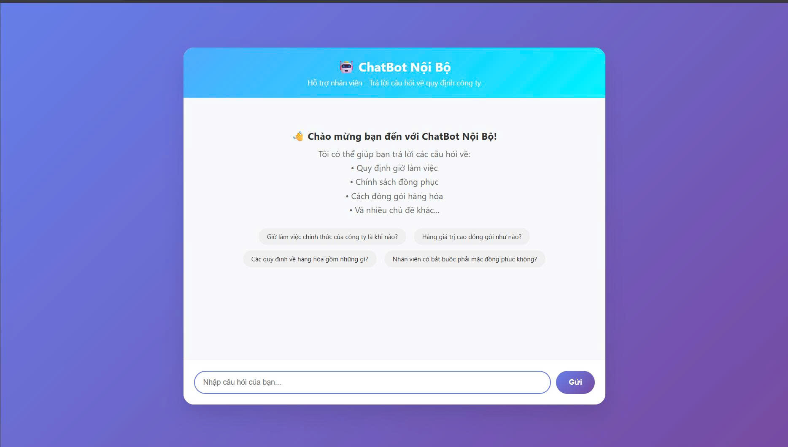
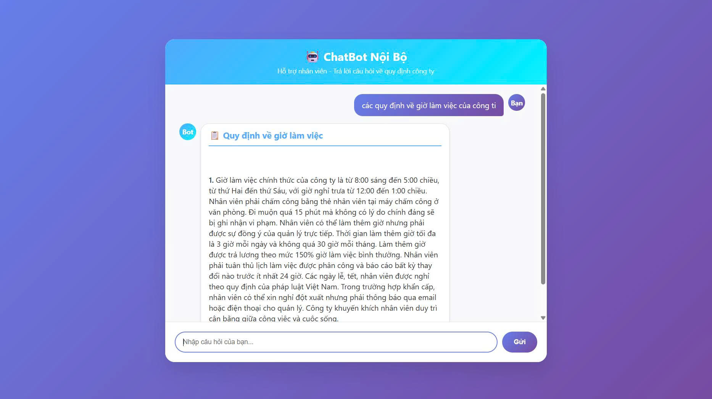
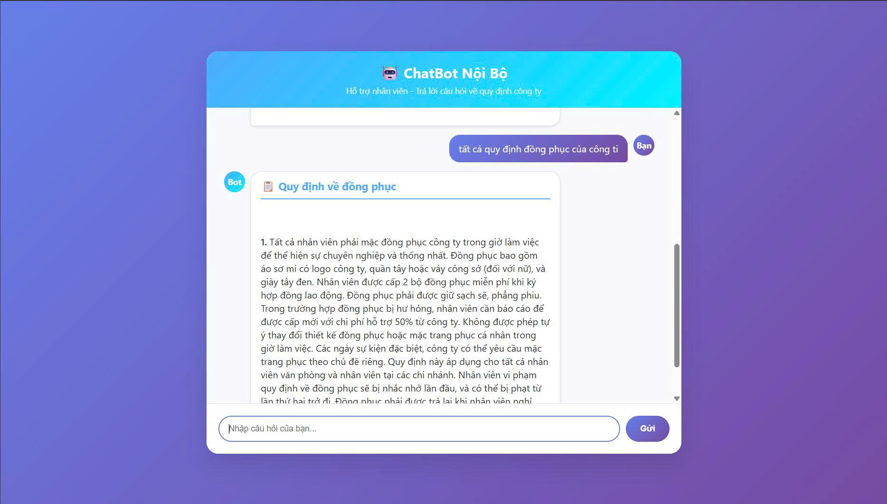
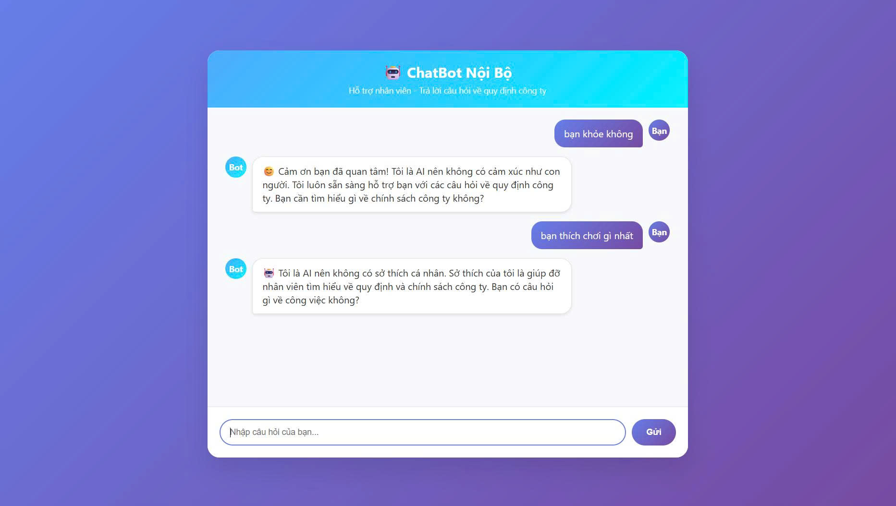

🤖 Dự án Chatbot đọc file nội bộ công ty (NLP + NER)

Chatbot được xây dựng để **trả lời tự động các câu hỏi FAQ** từ dữ liệu nội bộ của công ty.
**Lưu ý** 
1. File dữ liệu  duLieuCongTy.json được tạo **tự động hoàn toàn** bằng AI và không liên quan đến bất kì cá nhân, tổ chức nào
2. Các file data_chuDe.json đã xin phép ViettelPost trước khi scrap dữ liệu câu hỏi FAQ
3. Dự án sử dụng các kỹ thuật **NLP, NER, semantic search và rule-based matching** để tối ưu hóa khả năng trả lời chính xác.

---

## 🚀 Tính năng chính
- Dùng NLP và các công nghệ package hỗ trợ như **underthesea, difflib** để hiểu input câu hỏi + render câu trả lời 
- Tích hợp API **Flask**
- Đọc dữ liệu từ các file **JSON nội bộ**.
- Hỗ trợ **tìm kiếm chính xác** và **tìm kiếm ngữ nghĩa**.
- Tích hợp **Named Entity Recognition (NER)** để hiểu ngữ cảnh.
- Có cơ chế **fallback** khi không tìm thấy câu trả lời phù hợp.
- Ghi **log** toàn bộ **pipeline** để dễ dàng theo dõi và debug.


---

## 🏗️ Kiến trúc hệ thống
Pipeline xử lý câu hỏi trong chatbot:

## 📌 Pipeline xử lý câu hỏi (QA Pipeline)

1. **User query (input)**  
   - Người dùng nhập câu hỏi

2. **Exact question check**  
   - So sánh query với tất cả câu hỏi trong dữ liệu  
   - Nếu có duy nhất một match → trả ngay câu trả lời  
   - Nếu không → chuyển sang bước tiếp theo  

3. **Data Loading**  
   - Load file JSON nội bộ  
   - Index documents (dict hoặc vector DB)  
   - Error handling (xử lý lỗi JSON, file không hợp lệ)  
   - Logging (ghi lại số lượng dữ liệu load)  
   - Caching vectors (vectorize trước để tăng tốc)  

4. **Preprocessing**  
   - Tokenize, lowercase  
   - Loại bỏ stop words  
   - Lemmatize / Stem  
   - Logging  

5. **NER extraction**  
   - Phát hiện entity: Product, Date, Amount, Service,...  
   - Logging  

6. **Semantic search**  
   - Tính toán TF-IDF / Embedding  
   - Cosine similarity  
   - Entity-boosted search (tăng trọng số cho entity)  
   - Logging  

7. **Rule-based matching**  
   - Entity-aware matching  
   - Threshold check (nếu similarity thấp → fallback)  
   - Fallback response (ví dụ: *“Không tìm thấy thông tin”*)  
   - Logging  

8. **Reranking / Fusion**  
   - Kết hợp kết quả semantic search + rule-based  
   - Chọn câu trả lời tốt nhất  
   - Logging  

9. **Postprocessing**  
   - Format lại output trả lời  
   - Xử lý trường hợp không tìm thấy câu trả lời  
   - Logging  

10. **Return answer**  
    - Trả kết quả cuối cùng cho người dùng


### Giao diện khởi đầu của hệ thống 


###  Khi hỏi câu hỏi giống nhau, chatbot vẫn trả lời được 


###  Hỏi những câu hỏi tổng quát



###  Cơ chế fellback khi không phải chủ đề liên quan


---

## ⚙️ Cài đặt & chạy thử

1. Clone repo
```bash
git clone https://github.com/<username>/<repo>.git
cd du_an_chatBot_noi_bo
 2. Tạo môi trường ảo & cài dependency
python -m venv .venv
source .venv/bin/activate   # Linux/Mac
.venv\Scripts\activate      # Windows

3. Chạy ứng dụng Flask
python test.py 


